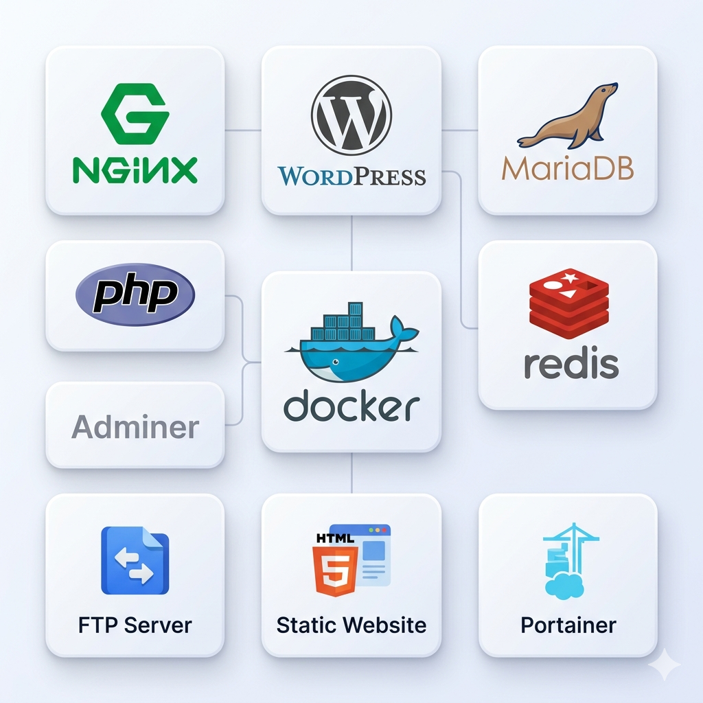

# Inception

> A system administration project from **42 School** -- deploying a small infrastructure using **Docker** and **Docker Compose**, with each service running in its own dedicated container.

---

## Overview

This project sets up a fully functional WordPress website served over HTTPS, using three core custom-built Docker containers, plus bonus services for file transfer, cache, and database administration:

| Service       | Role                              | Exposed port    |
|---------------|-----------------------------------|-----------------|
| **NGINX**     | Reverse proxy with TLS (SSL)      | 443 (host)      |
| **WordPress** | PHP-FPM application server        | 9000 (internal) |
| **MariaDB**   | Relational database backend       | 3306 (internal) |
| **Redis**     | In-memory cache backend           | 6379 (internal) |
| **Adminer**   | Database administration UI        | 8080 (host)     |
| **FTP**       | Passive file transfer service     | 21, 21100-21110 |

All images are built from **Debian trixie** and orchestrated via `docker compose`.

---

## Architecture

```
                    HTTPS (port 443)
User ──────────────────► NGINX
                            │
                    FastCGI (port 9000)
                            ▼
                       WordPress (PHP-FPM)
                            │
                      MySQL (port 3306)
                            ▼
                         MariaDB

                        │
                        │ Redis cache (port 6379)
                        ▼
                       Redis

    Adminer (port 8080) ───────► MariaDB

                    │
                    │ shared `wordpress_data` volume
                    ▼
               FTP (port 21)
                │
                └── Passive data ports 21100-21110
```

- **NGINX** is the only external entry point, listening on port 443 (TLSv1.2 / TLSv1.3).
- **WordPress** handles PHP processing via PHP-FPM and connects to MariaDB.
- **MariaDB** stores all WordPress data in a persistent Docker volume.
- **Redis** provides an in-memory cache backend for WordPress over the private Docker network.
- **Adminer** offers a lightweight browser-based interface to inspect and manage MariaDB.
- **FTP** provides authenticated file uploads and downloads through vsftpd, using the same WordPress data volume.
- All services communicate over a private Docker bridge network (`inception`).

---

## Project Structure

```
Inception/
├── Makefile
├── secrets/
│   ├── credentials.tx          # WordPress admin credentials
│   ├── db_password.txt         # MariaDB user password
│   └── db_root_password.txt    # MariaDB root password
└── srcs/
    ├── .env                    # Environment variables for docker compose
    ├── docker-compose.yml
    └── requirements/
        ├── mariadb/
        │   ├── Dockerfile
        │   ├── conf/
        │   │   └── my.cnf       # MariaDB configuration
        │   └── tools/
        │       └── init_db.sh   # DB init + user setup script
        ├── nginx/
        │   ├── Dockerfile
        │   ├── conf/
        │   │   └── nginx.conf   # NGINX + TLS configuration
        │   └── tools/
        │       └── start.sh     # SSL cert generation + nginx start
        ├── wordpress/
        │   ├── Dockerfile
        │   └── tools/
        │       └── setup.sh     # WordPress download + PHP-FPM start
        └── bonus/
            ├── adminer/
            │   └── Dockerfile
            ├── ftp/
            │   ├── Dockerfile
            │   ├── start.sh     # FTP startup script
            │   └── vsftpd.conf   # vsftpd configuration
            └── redis/
                ├── Dockerfile
                └── redis.conf   # Redis configuration
```

---

## Requirements

- [Docker](https://docs.docker.com/get-docker/) (v20+)
- [Docker Compose](https://docs.docker.com/compose/) (v2+)
- GNU Make

---

## Setup

### 1. Configure environment variables

Create `srcs/.env` with the following:

```env
MYSQL_DATABASE=wordpress
MYSQL_USER=wpuser
MYSQL_PASSWORD=<your_db_password>
MYSQL_ROOT_PASSWORD=<your_db_root_password>
```

> These values should match the passwords stored in the `secrets/` files.

### 2. Add the domain to `/etc/hosts`

```bash
echo "127.0.0.1  yourlogin.42.fr" | sudo tee -a /etc/hosts
```

> To use a different 42 login, also update `server_name` in `srcs/requirements/nginx/conf/nginx.conf` and the `-subj` flag in `srcs/requirements/nginx/tools/start.sh`.

---

## Usage

```bash
# Build images and start all containers (detached)
make

# Stop all running containers
make down

# Stop containers and remove volumes
make clean

# Full cleanup: containers, volumes, and all built images
make fclean

# Rebuild everything from scratch
make re
```

Once running, visit:

```
https://yourlogin.42.fr
```

> A self-signed SSL certificate is generated automatically at container startup. Your browser will show a security warning -- this is expected for local development and can be safely bypassed.

---

## Services

### NGINX
- Built from `debian:trixie`
- On startup, generates a self-signed RSA-2048 certificate valid for 365 days via `openssl`
- Only accepts **TLSv1.2** and **TLSv1.3** -- older protocols are disabled
- Routes all `.php` requests to WordPress over FastCGI on port 9000
- Serves static files directly from the shared `wordpress_data` volume

### WordPress
- Built from `debian:trixie`
- Runs **PHP 7.4-FPM** listening on TCP port 9000 (not a Unix socket)
- On first start: downloads the trixie WordPress tarball, extracts it, and writes `wp-config.php` from environment variables
- Uses `netcat` to poll MariaDB on port 3306 and waits for it to be ready before starting PHP-FPM

### MariaDB
- Built from `debian:trixie`
- On first start: initialises the data directory with `mysql_install_db`, spins up a temporary instance to create the database, WordPress user, and root password, then restarts normally
- Binds to `0.0.0.0` so WordPress can reach it over the Docker network
- Data is persisted in a named Docker volume (`mariadb_data`)

## Bonus

### Redis
- Built from `debian:trixie` and runs `redis-server` without protected mode
- Listens on port `6379` inside the Docker network and is not published to the host
- Used as an in-memory cache backend for WordPress to reduce repeated database work and speed up page delivery
- Communicates with WordPress over the private `inception` bridge network

### Adminer
- Built from `debian:trixie` and exposes its web interface on host port `8080`
- Connects directly to MariaDB through the Docker network, using the database container name as the host
- Provides a lightweight browser-based interface for managing the WordPress database without entering the MariaDB container
- Useful for inspecting tables, running queries, and verifying database state during development

### FTP
- Built from `debian:trixie` and powered by `vsftpd`
- Exposes the FTP control port on `21` and passive transfer ports on `21100-21110`
- Uses a local `ftpuser` account created at container startup, with the working directory rooted in `/home/ftpuser/ftp`
- Mounts the shared `wordpress_data` volume at `/var/www/html`, so uploaded files are immediately available to WordPress and NGINX
- Integrates with the private Docker network (`inception`) and extends the stack with direct file transfer support for content management

---

## Volumes

| Volume           | Container mount point | Purpose                             |
|------------------|-----------------------|-------------------------------------|
| `mariadb_data`   | `/var/lib/mysql`      | MariaDB database persistence        |
| `wordpress_data` | `/var/www/html`       | WordPress files (shared with NGINX) |

---

## Network

All containers are attached to the `inception` bridge network. Only NGINX publishes a port to the host (`443:443`). WordPress and MariaDB are not directly reachable from outside the Docker network.

---

## Author

**alarick** -- [42 School](https://42.fr)
